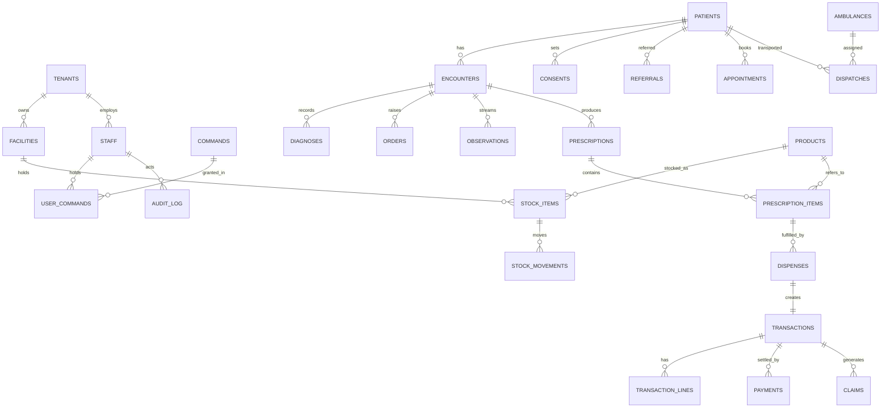

# 48 — Database Schema & ERD

The complete, migration-ready schema. PostgreSQL 16 with **PostGIS** (geospatial) and
**TimescaleDB** (vitals/IoT). Every patient/organisational row is multi-tenant and protected
by **row-level security (RLS)**. The same DDL is provided as a runnable migration at
[`backend/sql/0001_initial.sql`](../backend/sql/0001_initial.sql).

Design rationale: [24 — Database Design & Indexing](24-database-design-and-indexing.md) ·
conceptual model: [55](55-conceptual-data-model.md) · field dictionary: [61](61-data-dictionary.md) ·
naming: [46](46-naming-conventions.md).

## Conventions

- PKs are `UUID` (`gen_random_uuid()`); FKs are `<entity>_id`.
- Tenant-scoped tables carry `tenant_id` (+ `facility_id` where relevant) and have RLS enabled.
- **Global reference** tables (`commands`, `products`, `locations`) are not tenant-scoped — a
  drug or admin boundary means the same thing everywhere.
- `created_at` / `updated_at` are `timestamptz`; audit-sensitive history is append-only.

## ER diagram (core)



## DDL

### 1. Extensions & session context

```sql
CREATE EXTENSION IF NOT EXISTS pgcrypto;     -- gen_random_uuid()
CREATE EXTENSION IF NOT EXISTS pg_trgm;      -- trigram search (catalogue/ICD lookup)
CREATE EXTENSION IF NOT EXISTS postgis;      -- geospatial
CREATE EXTENSION IF NOT EXISTS timescaledb;  -- vitals/IoT hypertables

-- The app sets these per request from the validated JWT (see docs 04, 49).
-- current_setting('app.tenant_id', true), 'app.user_id', 'app.geo_scope'
```

### 2. Enumerated types

```sql
CREATE TYPE tenant_kind       AS ENUM ('facility','insurer','ngo','camp','supplier','government');
CREATE TYPE facility_level    AS ENUM ('chw','health_post','health_centre','district','provincial','referral','pharmacy');
CREATE TYPE sensitivity_level AS ENUM ('individual','facility','aggregate');
CREATE TYPE encounter_status  AS ENUM ('open','in_progress','ordered','referred','closed');
CREATE TYPE order_type        AS ENUM ('lab','imaging','medication');
CREATE TYPE order_status      AS ENUM ('placed','in_progress','resulted','signed','cancelled');
CREATE TYPE rx_status         AS ENUM ('signed','verified','partially_dispensed','dispensed','cancelled','expired');
CREATE TYPE claim_status      AS ENUM ('submitted','scrubbing','approved','disputed','paid','rejected');
CREATE TYPE referral_status   AS ENUM ('created','received','in_care','completed','cancelled');
CREATE TYPE appt_status       AS ENUM ('booked','confirmed','attended','missed','cancelled');
CREATE TYPE dispatch_status   AS ENUM ('requested','dispatched','en_route','on_scene','transporting','at_hospital','closed');
CREATE TYPE payment_method    AS ENUM ('momo','cash','insurer','cross_border','donor');
CREATE TYPE payment_status    AS ENUM ('pending','confirmed','failed','reversed');
CREATE TYPE consent_status    AS ENUM ('granted','revoked');
```

### 3. Global reference tables

```sql
CREATE TABLE commands (
    code        CHAR(4) PRIMARY KEY,
    domain      CHAR(2) NOT NULL,
    action      CHAR(2) NOT NULL,
    description TEXT NOT NULL
);

CREATE TABLE locations (              -- admin boundaries + facility points
    id          UUID PRIMARY KEY DEFAULT gen_random_uuid(),
    kind        TEXT NOT NULL,        -- province|district|sector|cell|village|point
    name        TEXT NOT NULL,
    parent_id   UUID REFERENCES locations(id),
    geom        geometry(Geometry, 4326)
);
CREATE INDEX gix_locations_geom ON locations USING gist (geom);

CREATE TABLE products (              -- shared medicine/device catalogue
    id            UUID PRIMARY KEY DEFAULT gen_random_uuid(),
    name          TEXT NOT NULL,
    atc           TEXT,
    fda_reg       TEXT,
    tax_category  TEXT,
    form          TEXT,
    strength      TEXT,
    is_controlled BOOLEAN NOT NULL DEFAULT false,
    created_at    TIMESTAMPTZ NOT NULL DEFAULT now()
);
CREATE INDEX idx_products_name_trgm ON products USING gin (name gin_trgm_ops);
```

### 4. Tenancy & access

```sql
CREATE TABLE tenants (
    id          UUID PRIMARY KEY DEFAULT gen_random_uuid(),
    name        TEXT NOT NULL,
    kind        tenant_kind NOT NULL,
    created_at  TIMESTAMPTZ NOT NULL DEFAULT now()
);

CREATE TABLE facilities (
    id          UUID PRIMARY KEY DEFAULT gen_random_uuid(),
    tenant_id   UUID NOT NULL REFERENCES tenants(id),
    name        TEXT NOT NULL,
    level       facility_level NOT NULL,
    location_id UUID REFERENCES locations(id),
    created_at  TIMESTAMPTZ NOT NULL DEFAULT now(),
    updated_at  TIMESTAMPTZ NOT NULL DEFAULT now()
);
CREATE INDEX idx_facilities_tenant ON facilities(tenant_id);

CREATE TABLE staff (
    id              UUID PRIMARY KEY DEFAULT gen_random_uuid(),
    tenant_id       UUID NOT NULL REFERENCES tenants(id),
    facility_id     UUID REFERENCES facilities(id),
    nida_id         TEXT,
    full_name       TEXT NOT NULL,
    geo_scope       JSONB NOT NULL DEFAULT '{}',   -- {province,district,sector,cell?}
    max_sensitivity sensitivity_level NOT NULL DEFAULT 'individual',
    status          TEXT NOT NULL DEFAULT 'active', -- active|locked|deactivated
    created_at      TIMESTAMPTZ NOT NULL DEFAULT now(),
    updated_at      TIMESTAMPTZ NOT NULL DEFAULT now()
);
CREATE INDEX idx_staff_tenant ON staff(tenant_id);

CREATE TABLE user_commands (
    staff_id   UUID NOT NULL REFERENCES staff(id) ON DELETE CASCADE,
    command    CHAR(4) NOT NULL REFERENCES commands(code),
    granted_by UUID REFERENCES staff(id),
    granted_at TIMESTAMPTZ NOT NULL DEFAULT now(),
    PRIMARY KEY (staff_id, command)
);

CREATE TABLE consents (
    id          UUID PRIMARY KEY DEFAULT gen_random_uuid(),
    tenant_id   UUID NOT NULL REFERENCES tenants(id),
    patient_id  UUID NOT NULL,
    actor_scope JSONB NOT NULL,        -- {role|staff_id|tenant_id, data_category}
    status      consent_status NOT NULL DEFAULT 'granted',
    updated_at  TIMESTAMPTZ NOT NULL DEFAULT now()
);
CREATE INDEX idx_consents_patient ON consents(patient_id);
```

### 5. Clinical

```sql
CREATE TABLE patients (
    id           UUID PRIMARY KEY DEFAULT gen_random_uuid(),
    tenant_id    UUID NOT NULL REFERENCES tenants(id),
    nida_id      TEXT,
    is_temporary BOOLEAN NOT NULL DEFAULT false,
    given_name   TEXT, family_name TEXT, sex TEXT, birth_date DATE,
    home_location_id UUID REFERENCES locations(id),
    created_at   TIMESTAMPTZ NOT NULL DEFAULT now(),
    updated_at   TIMESTAMPTZ NOT NULL DEFAULT now()
);
CREATE UNIQUE INDEX uq_patients_nida ON patients(nida_id) WHERE nida_id IS NOT NULL;
CREATE INDEX idx_patients_tenant ON patients(tenant_id, id);

CREATE TABLE encounters (
    id            UUID PRIMARY KEY DEFAULT gen_random_uuid(),
    tenant_id     UUID NOT NULL REFERENCES tenants(id),
    facility_id   UUID NOT NULL REFERENCES facilities(id),
    patient_id    UUID NOT NULL REFERENCES patients(id),
    status        encounter_status NOT NULL DEFAULT 'open',
    encounter_date TIMESTAMPTZ NOT NULL DEFAULT now(),
    created_by    UUID NOT NULL REFERENCES staff(id),
    created_at    TIMESTAMPTZ NOT NULL DEFAULT now()
);
CREATE INDEX idx_enc_history ON encounters(patient_id, encounter_date DESC);
CREATE INDEX idx_enc_queue   ON encounters(facility_id, status);
CREATE INDEX brin_enc_created ON encounters USING brin(created_at);

CREATE TABLE diagnoses (
    id           UUID PRIMARY KEY DEFAULT gen_random_uuid(),
    tenant_id    UUID NOT NULL,
    encounter_id UUID NOT NULL REFERENCES encounters(id),
    icd_code     TEXT NOT NULL,
    note         TEXT,
    created_by   UUID NOT NULL REFERENCES staff(id),
    created_at   TIMESTAMPTZ NOT NULL DEFAULT now()
);
CREATE INDEX idx_dx_encounter ON diagnoses(encounter_id);

CREATE TABLE orders (
    id           UUID PRIMARY KEY DEFAULT gen_random_uuid(),
    tenant_id    UUID NOT NULL,
    encounter_id UUID NOT NULL REFERENCES encounters(id),
    type         order_type NOT NULL,
    status       order_status NOT NULL DEFAULT 'placed',
    detail       JSONB NOT NULL DEFAULT '{}',
    created_by   UUID NOT NULL REFERENCES staff(id),
    created_at   TIMESTAMPTZ NOT NULL DEFAULT now()
);
CREATE INDEX idx_orders_encounter ON orders(encounter_id, type);

CREATE TABLE lab_results (
    id          UUID PRIMARY KEY DEFAULT gen_random_uuid(),
    tenant_id   UUID NOT NULL,
    order_id    UUID NOT NULL REFERENCES orders(id),
    analyte     TEXT NOT NULL,
    value       TEXT NOT NULL,
    unit        TEXT,
    signed_by   UUID REFERENCES staff(id),
    signed_at   TIMESTAMPTZ
);

CREATE TABLE imaging_reports (
    id          UUID PRIMARY KEY DEFAULT gen_random_uuid(),
    tenant_id   UUID NOT NULL,
    order_id    UUID NOT NULL REFERENCES orders(id),
    dicom_ref   TEXT,                 -- object key in MinIO
    report      TEXT,
    signature   BYTEA,
    signed_by   UUID REFERENCES staff(id),
    signed_at   TIMESTAMPTZ
);

CREATE TABLE observations (          -- discrete clinical observations
    id           UUID PRIMARY KEY DEFAULT gen_random_uuid(),
    tenant_id    UUID NOT NULL,
    encounter_id UUID NOT NULL REFERENCES encounters(id),
    metric       TEXT NOT NULL,
    value        DOUBLE PRECISION,
    unit         TEXT,
    observed_at  TIMESTAMPTZ NOT NULL DEFAULT now()
);

CREATE TABLE vitals_stream (         -- high-frequency stream (hypertable)
    tenant_id    UUID NOT NULL,
    encounter_id UUID NOT NULL,
    ts           TIMESTAMPTZ NOT NULL,
    metric       TEXT NOT NULL,       -- hr | bp_sys | bp_dia | spo2 | ...
    value        DOUBLE PRECISION NOT NULL
);
SELECT create_hypertable('vitals_stream','ts', if_not_exists => TRUE);
CREATE INDEX idx_vitals_enc ON vitals_stream(encounter_id, ts DESC);
```

### 6. Pharmacy & supply

```sql
CREATE TABLE prescriptions (
    id           UUID PRIMARY KEY DEFAULT gen_random_uuid(),
    tenant_id    UUID NOT NULL,
    encounter_id UUID NOT NULL REFERENCES encounters(id),
    code         TEXT NOT NULL,
    status       rx_status NOT NULL DEFAULT 'signed',
    signed_by    UUID NOT NULL REFERENCES staff(id),
    signature    BYTEA NOT NULL,
    created_at   TIMESTAMPTZ NOT NULL DEFAULT now()
);
CREATE UNIQUE INDEX uq_rx_code ON prescriptions(code);

CREATE TABLE prescription_items (
    id              UUID PRIMARY KEY DEFAULT gen_random_uuid(),
    tenant_id       UUID NOT NULL,
    prescription_id UUID NOT NULL REFERENCES prescriptions(id) ON DELETE CASCADE,
    product_id      UUID NOT NULL REFERENCES products(id),
    dose            TEXT, quantity INTEGER NOT NULL CHECK (quantity > 0)
);

CREATE TABLE stock_items (
    id          UUID PRIMARY KEY DEFAULT gen_random_uuid(),
    tenant_id   UUID NOT NULL,
    facility_id UUID NOT NULL REFERENCES facilities(id),
    product_id  UUID NOT NULL REFERENCES products(id),
    batch       TEXT NOT NULL,
    expiry_date DATE NOT NULL,
    quantity    INTEGER NOT NULL CHECK (quantity >= 0),
    shelf       TEXT,
    updated_at  TIMESTAMPTZ NOT NULL DEFAULT now()
);
CREATE INDEX idx_stock_fefo ON stock_items(facility_id, product_id, expiry_date ASC);
CREATE INDEX idx_stock_low  ON stock_items(facility_id, product_id) WHERE quantity < 10;

CREATE TABLE stock_movements (       -- receive | transfer | dispense | adjust
    id          UUID PRIMARY KEY DEFAULT gen_random_uuid(),
    tenant_id   UUID NOT NULL,
    stock_item_id UUID NOT NULL REFERENCES stock_items(id),
    kind        TEXT NOT NULL,
    quantity    INTEGER NOT NULL,
    ref_id      UUID,                 -- dispense/PO/transfer reference
    created_by  UUID REFERENCES staff(id),
    created_at  TIMESTAMPTZ NOT NULL DEFAULT now()
);
CREATE INDEX idx_movements_item ON stock_movements(stock_item_id, created_at);

CREATE TABLE dispenses (
    id                  UUID PRIMARY KEY DEFAULT gen_random_uuid(),
    tenant_id           UUID NOT NULL,
    prescription_item_id UUID REFERENCES prescription_items(id),
    stock_item_id       UUID NOT NULL REFERENCES stock_items(id),
    quantity            INTEGER NOT NULL CHECK (quantity > 0),
    dispensed_by        UUID NOT NULL REFERENCES staff(id),
    created_at          TIMESTAMPTZ NOT NULL DEFAULT now()
);
```

### 7. Finance

```sql
CREATE TABLE transactions (
    id               UUID PRIMARY KEY DEFAULT gen_random_uuid(),
    tenant_id        UUID NOT NULL,
    facility_id      UUID NOT NULL REFERENCES facilities(id),
    patient_id       UUID REFERENCES patients(id),
    insurer_portion  NUMERIC(12,2) NOT NULL DEFAULT 0,
    out_of_pocket    NUMERIC(12,2) NOT NULL DEFAULT 0,
    ebm_token        TEXT,
    transaction_date TIMESTAMPTZ NOT NULL DEFAULT now()
);
CREATE INDEX idx_txn_recon ON transactions(facility_id, transaction_date);

CREATE TABLE transaction_lines (
    id             UUID PRIMARY KEY DEFAULT gen_random_uuid(),
    tenant_id      UUID NOT NULL,
    transaction_id UUID NOT NULL REFERENCES transactions(id) ON DELETE CASCADE,
    product_id     UUID REFERENCES products(id),
    quantity       INTEGER NOT NULL,
    unit_price     NUMERIC(12,2) NOT NULL,
    line_total     NUMERIC(12,2) NOT NULL
);

CREATE TABLE payments (
    id             UUID PRIMARY KEY DEFAULT gen_random_uuid(),
    tenant_id      UUID NOT NULL,
    transaction_id UUID NOT NULL REFERENCES transactions(id),
    method         payment_method NOT NULL,
    status         payment_status NOT NULL DEFAULT 'pending',
    amount         NUMERIC(12,2) NOT NULL,
    provider_ref   TEXT,             -- MoMo request id, etc.
    created_at     TIMESTAMPTZ NOT NULL DEFAULT now()
);
CREATE INDEX idx_payments_txn ON payments(transaction_id);

CREATE TABLE claims (
    id             UUID PRIMARY KEY DEFAULT gen_random_uuid(),
    tenant_id      UUID NOT NULL,    -- provider tenant
    transaction_id UUID NOT NULL REFERENCES transactions(id),
    insurer_id     UUID NOT NULL REFERENCES tenants(id),
    status         claim_status NOT NULL DEFAULT 'submitted',
    reason_code    TEXT,
    amount         NUMERIC(12,2) NOT NULL,
    created_at     TIMESTAMPTZ NOT NULL DEFAULT now()
);
CREATE INDEX idx_claims_pending ON claims(insurer_id) WHERE status IN ('submitted','scrubbing','disputed');
```

### 8. Coordination, emergency, community & HR

```sql
CREATE TABLE referrals (
    id            UUID PRIMARY KEY DEFAULT gen_random_uuid(),
    tenant_id     UUID NOT NULL,
    patient_id    UUID NOT NULL REFERENCES patients(id),
    from_facility UUID REFERENCES facilities(id),
    to_facility   UUID REFERENCES facilities(id),
    tracking_code CHAR(6) NOT NULL,
    status        referral_status NOT NULL DEFAULT 'created',
    context       JSONB NOT NULL DEFAULT '{}',
    created_at    TIMESTAMPTZ NOT NULL DEFAULT now()
);
CREATE UNIQUE INDEX uq_referral_code ON referrals(tracking_code);

CREATE TABLE appointments (
    id          UUID PRIMARY KEY DEFAULT gen_random_uuid(),
    tenant_id   UUID NOT NULL,
    patient_id  UUID NOT NULL REFERENCES patients(id),
    facility_id UUID NOT NULL REFERENCES facilities(id),
    staff_id    UUID REFERENCES staff(id),
    scheduled_for TIMESTAMPTZ NOT NULL,
    status      appt_status NOT NULL DEFAULT 'booked',
    created_at  TIMESTAMPTZ NOT NULL DEFAULT now()
);
CREATE INDEX idx_appt_sched ON appointments(facility_id, scheduled_for);

CREATE TABLE ambulances (
    id          UUID PRIMARY KEY DEFAULT gen_random_uuid(),
    tenant_id   UUID NOT NULL REFERENCES tenants(id),
    plate       TEXT NOT NULL,
    type        TEXT NOT NULL,        -- bls | als
    status      TEXT NOT NULL DEFAULT 'available',
    last_geom   geometry(Point,4326)
);
CREATE INDEX gix_ambulance_geom ON ambulances USING gist (last_geom);

CREATE TABLE dispatches (
    id          UUID PRIMARY KEY DEFAULT gen_random_uuid(),
    tenant_id   UUID NOT NULL,
    ambulance_id UUID REFERENCES ambulances(id),
    patient_id  UUID REFERENCES patients(id),
    origin_geom geometry(Point,4326),
    dest_facility UUID REFERENCES facilities(id),
    status      dispatch_status NOT NULL DEFAULT 'requested',
    created_at  TIMESTAMPTZ NOT NULL DEFAULT now()
);

CREATE TABLE chw_visits (
    id          UUID PRIMARY KEY DEFAULT gen_random_uuid(),
    tenant_id   UUID NOT NULL,
    chw_id      UUID NOT NULL REFERENCES staff(id),
    patient_id  UUID REFERENCES patients(id),
    village_id  UUID REFERENCES locations(id),
    kind        TEXT NOT NULL,        -- iccm | anc | pnc | fp | tb | ncd
    payload     JSONB NOT NULL DEFAULT '{}',
    gps_ok      BOOLEAN NOT NULL DEFAULT true,
    created_at  TIMESTAMPTZ NOT NULL DEFAULT now()
);

CREATE TABLE licences (
    id          UUID PRIMARY KEY DEFAULT gen_random_uuid(),
    tenant_id   UUID NOT NULL,
    staff_id    UUID NOT NULL REFERENCES staff(id),
    council     TEXT NOT NULL,
    number      TEXT NOT NULL,
    expires_on  DATE NOT NULL
);
CREATE INDEX idx_licences_expiry ON licences(expires_on);

CREATE TABLE employment_contracts (
    id          UUID PRIMARY KEY DEFAULT gen_random_uuid(),
    tenant_id   UUID NOT NULL,
    staff_id    UUID NOT NULL REFERENCES staff(id),
    signed_hash TEXT NOT NULL,        -- QR-verifiable signed document hash
    starts_on   DATE NOT NULL,
    ends_on     DATE
);
```

### 9. Audit chain

```sql
CREATE TABLE audit_log (
    id            BIGINT GENERATED ALWAYS AS IDENTITY PRIMARY KEY,
    tenant_id     UUID,
    actor_id      UUID NOT NULL,
    command       CHAR(4) NOT NULL,
    resource_type TEXT NOT NULL,
    resource_id   UUID,
    payload_hash  TEXT NOT NULL,                 -- SHA-256 of action payload
    prev_hash     TEXT NOT NULL,
    current_hash  TEXT NOT NULL,                 -- SHA256(prev||payload||actor||ts)
    ts            TIMESTAMPTZ NOT NULL DEFAULT now()
);
CREATE INDEX idx_audit_actor    ON audit_log(actor_id, ts);
CREATE INDEX idx_audit_resource ON audit_log(resource_type, resource_id);
-- append-only: see GRANTs below.
```

### 10. Row-Level Security

```sql
-- Enable RLS and apply the standard tenant-isolation policy to every tenant-scoped table.
DO $$
DECLARE t text;
BEGIN
  FOREACH t IN ARRAY ARRAY[
    'facilities','staff','consents','patients','encounters','diagnoses','orders',
    'lab_results','imaging_reports','observations','vitals_stream','prescriptions',
    'prescription_items','stock_items','stock_movements','dispenses','transactions',
    'transaction_lines','payments','claims','referrals','appointments','ambulances',
    'dispatches','chw_visits','licences','employment_contracts'
  ] LOOP
    EXECUTE format('ALTER TABLE %I ENABLE ROW LEVEL SECURITY;', t);
    EXECUTE format($p$
      CREATE POLICY tenant_isolation ON %I
      USING (tenant_id = current_setting('app.tenant_id', true)::uuid)
      WITH CHECK (tenant_id = current_setting('app.tenant_id', true)::uuid);
    $p$, t);
  END LOOP;
END $$;

-- FORCE ROW LEVEL SECURITY is also applied so the policy binds even when the app connects
-- as the table owner (see the migration files). In production the app should additionally
-- connect as a dedicated NON-owner role for defence in depth.
-- Patient access also respects consent (enforced in the service layer in addition to RLS).
-- A dedicated read-only analytics role bypasses RLS for de-identified aggregates only:
-- CREATE ROLE analytics_ro BYPASSRLS;  (granted SELECT on materialized views, not base tables)

-- Audit log is append-only for application roles.
REVOKE UPDATE, DELETE ON audit_log FROM PUBLIC;
```

### 11. Triggers

```sql
CREATE OR REPLACE FUNCTION set_updated_at() RETURNS trigger AS $$
BEGIN NEW.updated_at = now(); RETURN NEW; END $$ LANGUAGE plpgsql;

DO $$
DECLARE t text;
BEGIN
  FOREACH t IN ARRAY ARRAY['facilities','staff','patients','stock_items'] LOOP
    EXECUTE format('CREATE TRIGGER trg_%1$s_updated BEFORE UPDATE ON %1$s
                    FOR EACH ROW EXECUTE FUNCTION set_updated_at();', t);
  END LOOP;
END $$;
```

### 12. Partitioning & TimescaleDB

```sql
-- High-volume tables are range-partitioned by month in production. Example:
--   CREATE TABLE encounters (...) PARTITION BY RANGE (encounter_date);
--   CREATE TABLE encounters_2026_06 PARTITION OF encounters
--     FOR VALUES FROM ('2026-06-01') TO ('2026-07-01');
-- stock_items is hash-partitioned by facility_id across nodes.
-- vitals_stream is a TimescaleDB hypertable (declared above) with chunk compression
--   for data older than 30 days:
ALTER TABLE vitals_stream SET (timescaledb.compress);
SELECT add_compression_policy('vitals_stream', INTERVAL '30 days');
```

### 13. Materialized views (dashboards)

```sql
CREATE MATERIALIZED VIEW mv_facility_daily AS
SELECT facility_id, date_trunc('day', encounter_date) AS day, count(*) AS encounters
FROM encounters GROUP BY 1,2;
-- Refreshed on schedule (Celery), never computed on demand. Add more per doc 14.
```

### 14. FHIR mapping

| Table | FHIR R4 resource |
|---|---|
| `patients` | `Patient` |
| `encounters` | `Encounter` |
| `diagnoses` | `Condition` |
| `orders` (medication) / `prescription_items` | `MedicationRequest` |
| `orders` (lab/imaging) | `ServiceRequest` |
| `observations` / `vitals_stream` / `lab_results` | `Observation` |
| `facilities` | `Organization` / `Location` |

## Domain extensions (migration `0002`)

Later domains add tables in [`backend/sql/0002_domain_extensions.sql`](../backend/sql/0002_domain_extensions.sql)
(applied after `0001`), each tenant-scoped with RLS:

| Table | Purpose |
|---|---|
| `cbhi_members` / `cbhi_premiums` | CBHI/mutuelle enrolment and premium collections |
| `purchase_orders` / `purchase_order_lines` | B2B supply-chain purchase orders |
| `drug_registrations` / `adverse_events` (`0003`) | Rwanda FDA registration + pharmacovigilance (national) |
| `deliveries` / `births` (`0003`) | Maternity records feeding civil registration |

## Seeding & migration notes

- Seed `commands` from the catalogue in [03](03-command-catalogue.md) (all ~115 codes).
- Seed `locations` from the national administrative-boundary GeoJSON.
- Seed `products` from the Rwanda FDA register / Essential Medicines List.
- Apply order: extensions → enums → reference → tenancy → clinical → pharmacy → finance →
  coordination/emergency/HR → audit → RLS → triggers → partitioning → views.
- Runnable copy: [`backend/sql/0001_initial.sql`](../backend/sql/0001_initial.sql).
