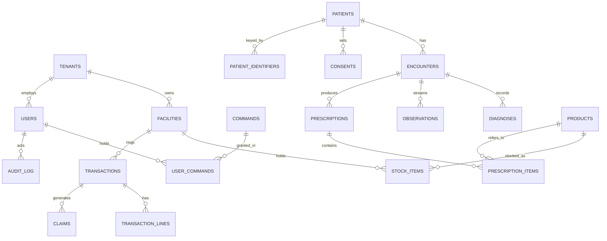

# 48 — Database Schema & ERD

The concrete schema behind the design rationale in
[24 — Database Design & Indexing](24-database-design-and-indexing.md). PostgreSQL 16 with
PostGIS (geospatial) and TimescaleDB (vitals/IoT). Every patient/organisational row is
multi-tenant and protected by **row-level security (RLS)**.

## Conventions

- Tables: plural `snake_case`; PKs are `UUID` (`gen_random_uuid()`).
- Every data-bearing table carries `tenant_id` and (where applicable) `facility_id`.
- Timestamps: `created_at`, `updated_at` (`timestamptz`); audit-sensitive tables are
  append-only with `valid_from` / `valid_to` (bitemporal).
- See [46 — Naming Conventions](46-naming-conventions.md).

## Entity-relationship overview



## Core tables (DDL excerpts)

```sql
CREATE TABLE tenants (
    id          UUID PRIMARY KEY DEFAULT gen_random_uuid(),
    name        TEXT NOT NULL,
    kind        TEXT NOT NULL,           -- facility | insurer | ngo | camp | supplier
    created_at  TIMESTAMPTZ NOT NULL DEFAULT now()
);

CREATE TABLE facilities (
    id          UUID PRIMARY KEY DEFAULT gen_random_uuid(),
    tenant_id   UUID NOT NULL REFERENCES tenants(id),
    name        TEXT NOT NULL,
    level       TEXT NOT NULL,           -- chw | health_centre | district | provincial | referral
    location_id UUID REFERENCES locations(id),
    created_at  TIMESTAMPTZ NOT NULL DEFAULT now()
);

-- Four-axis access: a user holds COMMANDS, scoped by geo/tenant/sensitivity.
CREATE TABLE users (
    id            UUID PRIMARY KEY DEFAULT gen_random_uuid(),
    tenant_id     UUID NOT NULL REFERENCES tenants(id),
    facility_id   UUID REFERENCES facilities(id),
    nida_id       TEXT,                  -- verified, not the PK
    full_name     TEXT NOT NULL,
    geo_scope     JSONB NOT NULL,        -- {province, district, sector, cell?}
    max_sensitivity TEXT NOT NULL,       -- individual | facility | aggregate
    status        TEXT NOT NULL DEFAULT 'active',
    created_at    TIMESTAMPTZ NOT NULL DEFAULT now()
);

CREATE TABLE commands (              -- the ~110 command catalogue (doc 03)
    code        CHAR(4) PRIMARY KEY,     -- e.g. PTRG, RXDP, ANVW
    domain      CHAR(2) NOT NULL,
    action      CHAR(2) NOT NULL,
    description TEXT NOT NULL
);

CREATE TABLE user_commands (         -- the command bundle
    user_id     UUID NOT NULL REFERENCES users(id),
    command     CHAR(4) NOT NULL REFERENCES commands(code),
    granted_by  UUID NOT NULL REFERENCES users(id),
    granted_at  TIMESTAMPTZ NOT NULL DEFAULT now(),
    PRIMARY KEY (user_id, command)
);

CREATE TABLE patients (
    id          UUID PRIMARY KEY DEFAULT gen_random_uuid(),
    tenant_id   UUID NOT NULL REFERENCES tenants(id),
    nida_id     TEXT,                    -- verified attribute; UNIQUE when present
    is_temporary BOOLEAN NOT NULL DEFAULT false,
    given_name  TEXT, family_name TEXT, sex TEXT, birth_date DATE,
    created_at  TIMESTAMPTZ NOT NULL DEFAULT now()
);
CREATE UNIQUE INDEX uq_patients_nida ON patients(nida_id) WHERE nida_id IS NOT NULL;
CREATE INDEX idx_patients_tenant ON patients(tenant_id, id);

CREATE TABLE encounters (
    id            UUID PRIMARY KEY DEFAULT gen_random_uuid(),
    tenant_id     UUID NOT NULL,
    facility_id   UUID NOT NULL REFERENCES facilities(id),
    patient_id    UUID NOT NULL REFERENCES patients(id),
    status        TEXT NOT NULL,         -- open | closed | referred
    encounter_date TIMESTAMPTZ NOT NULL DEFAULT now(),
    created_by    UUID NOT NULL REFERENCES users(id),
    created_at    TIMESTAMPTZ NOT NULL DEFAULT now()
);
CREATE INDEX idx_enc_history ON encounters(patient_id, encounter_date DESC);
CREATE INDEX idx_enc_queue   ON encounters(facility_id, status);
CREATE INDEX brin_enc_created ON encounters USING brin(created_at);

CREATE TABLE prescriptions (
    id          UUID PRIMARY KEY DEFAULT gen_random_uuid(),
    tenant_id   UUID NOT NULL,
    encounter_id UUID NOT NULL REFERENCES encounters(id),
    code        TEXT NOT NULL,           -- short human/SMS code
    signed_by   UUID NOT NULL REFERENCES users(id),
    signature   BYTEA NOT NULL,          -- RSA/ECDSA digital signature
    created_at  TIMESTAMPTZ NOT NULL DEFAULT now()
);
CREATE UNIQUE INDEX uq_rx_code ON prescriptions(code);

CREATE TABLE stock_items (
    id          UUID PRIMARY KEY DEFAULT gen_random_uuid(),
    tenant_id   UUID NOT NULL,
    facility_id UUID NOT NULL REFERENCES facilities(id),
    product_id  UUID NOT NULL REFERENCES products(id),
    batch       TEXT NOT NULL,
    expiry_date DATE NOT NULL,
    quantity    INTEGER NOT NULL CHECK (quantity >= 0),
    shelf       TEXT
);
-- FEFO selection index
CREATE INDEX idx_stock_fefo ON stock_items(facility_id, product_id, expiry_date ASC);
CREATE INDEX idx_stock_low  ON stock_items(facility_id, product_id) WHERE quantity < 10;

-- Vitals as a TimescaleDB hypertable
CREATE TABLE vitals_stream (
    encounter_id UUID NOT NULL,
    ts           TIMESTAMPTZ NOT NULL,
    metric       TEXT NOT NULL,          -- hr | bp_sys | bp_dia | spo2 | ...
    value        DOUBLE PRECISION NOT NULL
);
SELECT create_hypertable('vitals_stream', 'ts');
```

## Audit chain (immutable, SHA-256)

```sql
CREATE TABLE audit_log (
    id            BIGINT GENERATED ALWAYS AS IDENTITY PRIMARY KEY,
    tenant_id     UUID,
    actor_id      UUID NOT NULL,
    command       CHAR(4) NOT NULL,      -- the command executed
    resource_type TEXT NOT NULL,
    resource_id   UUID,
    payload_hash  TEXT NOT NULL,         -- SHA-256 of the action payload
    prev_hash     TEXT NOT NULL,         -- previous row's current_hash
    current_hash  TEXT NOT NULL,         -- SHA-256(prev_hash || payload_hash || actor || ts)
    ts            TIMESTAMPTZ NOT NULL DEFAULT now()
);
CREATE INDEX idx_audit_actor ON audit_log(actor_id, ts);
CREATE INDEX idx_audit_resource ON audit_log(resource_type, resource_id);
-- append-only: REVOKE UPDATE, DELETE from all roles; integrity verified on schedule.
```

`current_hash = SHA256(prev_hash || payload_hash || actor_id || ts)` — any edit to a
historical row breaks every subsequent hash and is detected on the scheduled verification
pass (see [34 — Audit Chain Integrity](34-audit-chain-integrity.md)).

## Row-level security & tenancy

```sql
ALTER TABLE patients ENABLE ROW LEVEL SECURITY;
CREATE POLICY p_tenant_isolation ON patients
    USING (tenant_id = current_setting('app.tenant_id')::uuid);
```

The application sets `app.tenant_id`, `app.geo_scope`, and `app.user_id` per request from the
validated JWT (see [49 — API Contract](49-api-contract.md) and
[35 — Multi-Tenancy and Data Isolation](35-multi-tenancy-and-data-isolation.md)).

## Partitioning

- `encounters`, `transactions` — range-partitioned by month.
- `stock_items` — hash-partitioned by `facility_id`.
- Materialised views for dashboard aggregates, refreshed on schedule.

## FHIR mapping

| Table | FHIR R4 resource |
|---|---|
| `patients` | `Patient` |
| `encounters` | `Encounter` |
| `diagnoses` | `Condition` |
| `prescriptions` / `prescription_items` | `MedicationRequest` |
| `observations` / `vitals_stream` | `Observation` |
| `facilities` | `Organization` / `Location` |
