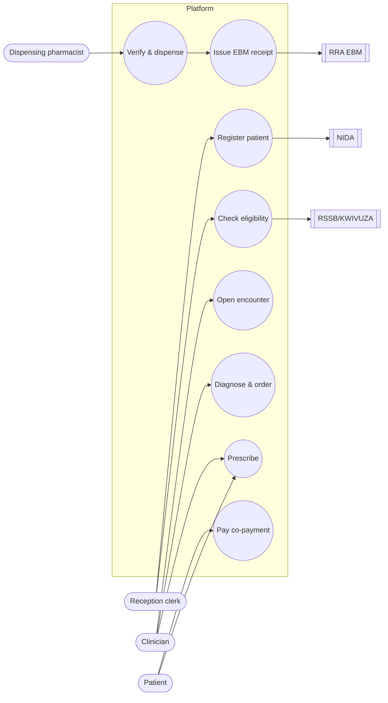

# 53 — Use Case Model

Actors and use cases for the platform, traced from the functional requirements in
[52 — SRS](52-software-requirements-specification.md). Each use case maps to one or more
**commands** (doc 03).

## Actors

- **Primary (human):** CHW, ASM, Reception clerk, Clinician, Nurse, Lab technologist,
  Radiologist, Dispensing pharmacist, Procurement officer, Pharmacy owner, Patient,
  Ambulance crew, SAMU dispatcher, DHO, District epidemiologist, CBHI manager, HR officer,
  Claims officer, IT/SOC analyst, MoH analyst.
- **Secondary (systems):** NIDA, RSSB/KWIVUZA, RRA EBM, DHIS2/eIDSR, SAMU/E-Banguka,
  Mobile Money, Africa's Talking (SMS/USSD), UNHCR ProGres.

## Use case diagram (clinical & pharmacy core)

## Use case descriptions (selected)

### UC-01 Register Patient
| Field | Value |
|---|---|
| Actors | Reception clerk (primary), NIDA (secondary) |
| Command | `PTRG` |
| Pre-conditions | Clerk authenticated; holds `PTRG`; in facility scope |
| Main flow | 1. Clerk scans national ID → 2. System queries NIDA → 3. Demographics auto-fill → 4. MPI checks duplicates → 5. Patient record created → 6. Audit entry written |
| Alternate | 4a. Duplicate found → offer `PTMG` merge. 2a. NIDA down → circuit breaker → manual entry, deferred verification |
| Post-conditions | Patient exists with unique ID; audit chained |
| Requirements | FR-01, FR-02, NFR-07 |

### UC-04 Prescribe
| Field | Value |
|---|---|
| Actors | Clinician (primary), Patient (receives SMS) |
| Command | `RXNW` |
| Pre-conditions | Open encounter; diagnosis recorded; clinician holds `RXNW` |
| Main flow | 1. Clinician selects drugs → 2. System validates ICD vs. order → 3. Clinician signs digitally → 4. Prescription stored → 5. SMS code sent to patient → 6. Pharmacy queue updated |
| Alternate | 2a. ICD/diagnosis mismatch → reject (422) |
| Post-conditions | Signed prescription; patient notified |
| Requirements | FR-05, FR-14, FR-19 |

### UC-05 Verify & Dispense
| Field | Value |
|---|---|
| Actors | Dispensing pharmacist; RSSB; RRA EBM |
| Command | `RXVF`, `RXDP` |
| Pre-conditions | Valid prescription code or walk-in; stock available |
| Main flow | 1. Enter Rx code → 2. Scan batch barcode (FEFO, expiry) → 3. Eligibility check → 4. Split insurer/out-of-pocket → 5. Collect MoMo co-pay → 6. Decrement stock → 7. Issue EBM receipt → 8. Queue claim |
| Alternate | 2a. Expired/empty batch → reject. 5a. MoMo fails → retry/cash |
| Post-conditions | Stock decremented; receipt issued; claim queued |
| Requirements | FR-06, FR-07, FR-08, FR-12 |

### UC-10 CHW Offline Visit
| Field | Value |
|---|---|
| Actors | CHW (*binôme*) |
| Command | `CHIC`, `CHRD`, `RFNW` |
| Pre-conditions | App installed; village polygon cached |
| Main flow | 1. Open app (GPS polygon verified offline) → 2. Run iCCM tree → 3. Log RDT, auto-dose, decrement kit → 4. Trigger referral with SMS code → 5. Queue to op-log → 6. Sync on reconnect |
| Alternate | 6a. Conflict on sync → human resolution (doc 51) |
| Post-conditions | Visit recorded; referral tracked; data syncs |
| Requirements | FR-10, FR-20 |

### UC-11 Emergency Dispatch
| Field | Value |
|---|---|
| Actors | Patient/SOS, SAMU dispatcher, Ambulance crew, receiving hospital |
| Command | `EMSO`, `EMIN`, `EMDS` |
| Pre-conditions | SAMU console online; ambulances reporting GPS |
| Main flow | 1. SOS/912 with GPS → 2. PostGIS nearest-unit query → 3. Dispatch with route → 4. Crew streams vitals → 5. Best facility matched → 6. ED pre-alerted → 7. Handover into EMR |
| Post-conditions | Patient transported; pre-hospital record continuous |
| Requirements | FR-11, NFR-09 |

## Traceability
Full FR ↔ use case ↔ design ↔ test mapping is in
[62 — Requirements Traceability Matrix](62-requirements-traceability-matrix.md).
