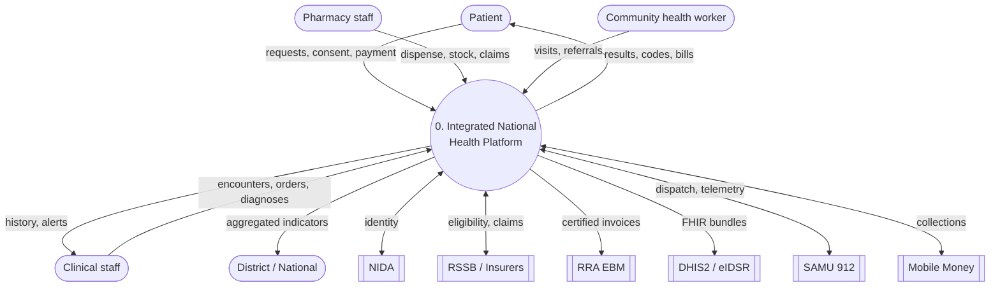
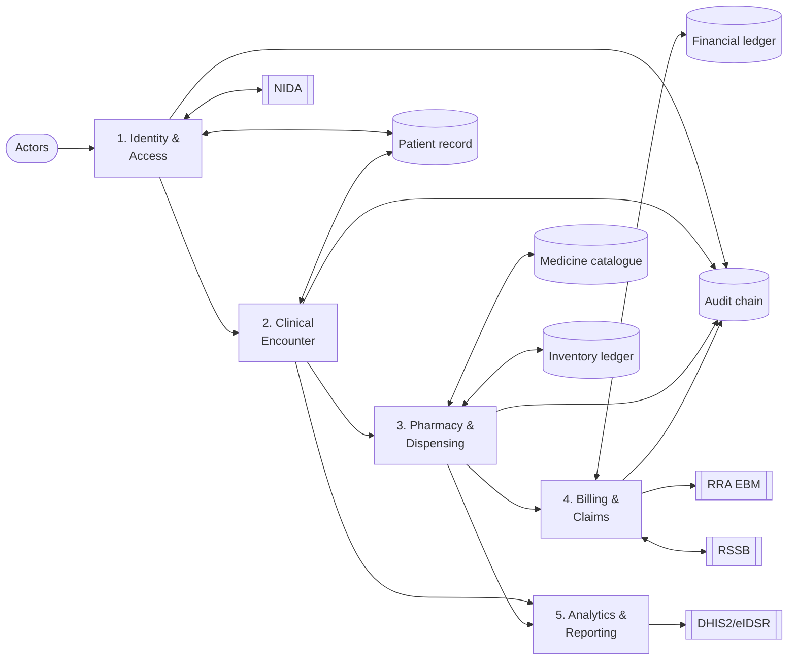
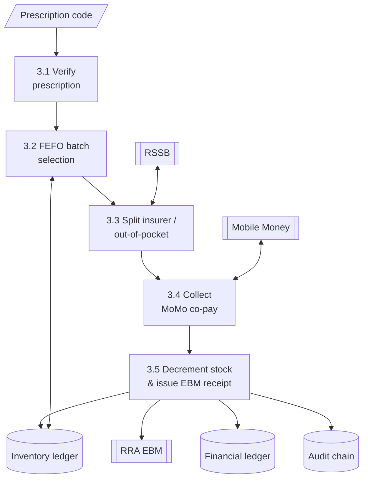

# 54 — Data Flow Diagrams (DFD)

Process view of how data moves through the platform, from the context level down to key
sub-processes. External systems are sources/sinks; the shared core is the central data store.

## Context diagram (Level 0)

## Level 1 — main processes

## Level 2 — Process 3: Pharmacy & Dispensing

## Notes
- Data stores correspond to the **shared core**: one patient record, one medicine catalogue,
  one inventory ledger, one financial ledger — plus the immutable audit chain.
- Every process writes to the audit chain (`D5`) for sensitive actions.
- External systems are reached through the resilience layer (circuit breaker) of doc 09.
