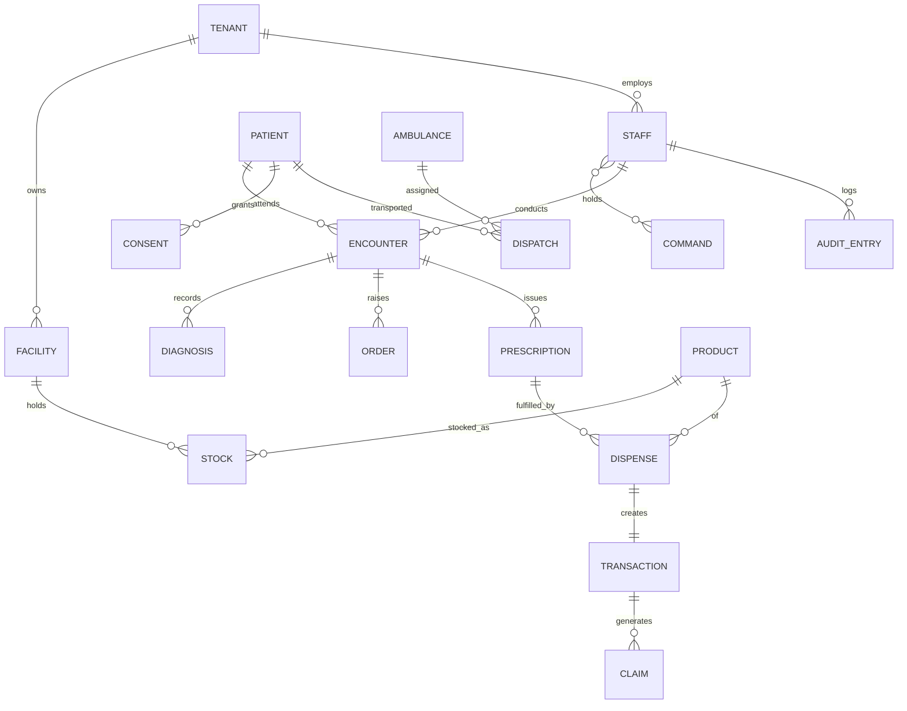

# 55 — Conceptual Data Model & Data Dictionary

The analysis-level data model — entities and relationships independent of the physical
schema. The physical PostgreSQL schema is in
[48 — Database Schema & ERD](48-database-schema.md); the full field dictionary is in
[61 — Data Dictionary](61-data-dictionary.md).

## Conceptual ER diagram

## Entity catalogue

| Entity | Description | Key attributes |
|---|---|---|
| **Tenant** | An organisation with isolated data | id, name, kind |
| **Facility** | A physical care/pharmacy site | id, tenant, level, location |
| **Staff** | A platform user | id, tenant, facility, nida, geo_scope, sensitivity |
| **Command** | An atomic access capability | code, domain, action |
| **Patient** | A person receiving care | id, nida, names, sex, birth_date, is_temporary |
| **Consent** | A patient's data-sharing permission | id, patient, actor/scope, status |
| **Encounter** | A care interaction | id, patient, facility, status, date |
| **Diagnosis** | An ICD-coded finding | id, encounter, icd_code |
| **Order** | A lab/imaging/medication request | id, encounter, type, status |
| **Prescription** | A signed medication order | id, encounter, code, signature |
| **Product** | A catalogue item (drug/device) | id, name, atc, fda_reg, tax_category |
| **Stock** | A batch held at a facility | id, facility, product, batch, expiry, qty |
| **Dispense** | A fulfilment event | id, prescription, product, batch, qty |
| **Transaction** | A POS sale | id, facility, lines, totals, ebm_token |
| **Claim** | An insurance claim | id, transaction, insurer, status |
| **Ambulance** | A tracked EMS asset | id, type, status, gps |
| **Dispatch** | An emergency assignment | id, ambulance, patient, route, status |
| **Audit Entry** | An immutable logged action | id, actor, command, resource, hashes, ts |

## Key relationships & rules
- Every business entity belongs to a **Tenant** (multi-tenant isolation).
- A **Patient** has exactly one longitudinal record but many encounters across facilities.
- **Consent** is enforced *in addition to* a Staff member's command/scope.
- A **Dispense** always produces a **Transaction**; a Transaction may produce a **Claim**.
- Every create/update/delete on a sensitive entity produces an **Audit Entry** chained to the
  previous one.

## Cardinality summary
| Relationship | Cardinality |
|---|---|
| Tenant — Facility | 1 : N |
| Patient — Encounter | 1 : N |
| Encounter — Prescription | 1 : N |
| Prescription — Dispense | 1 : N |
| Product — Stock | 1 : N |
| Transaction — Claim | 1 : 0..1 |
| Staff — Command | M : N |
