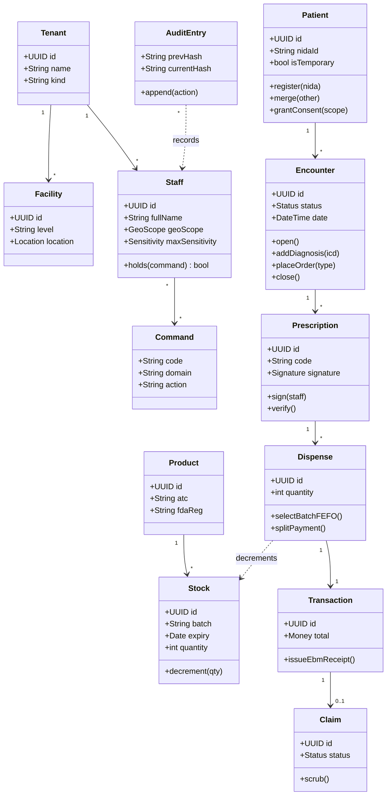
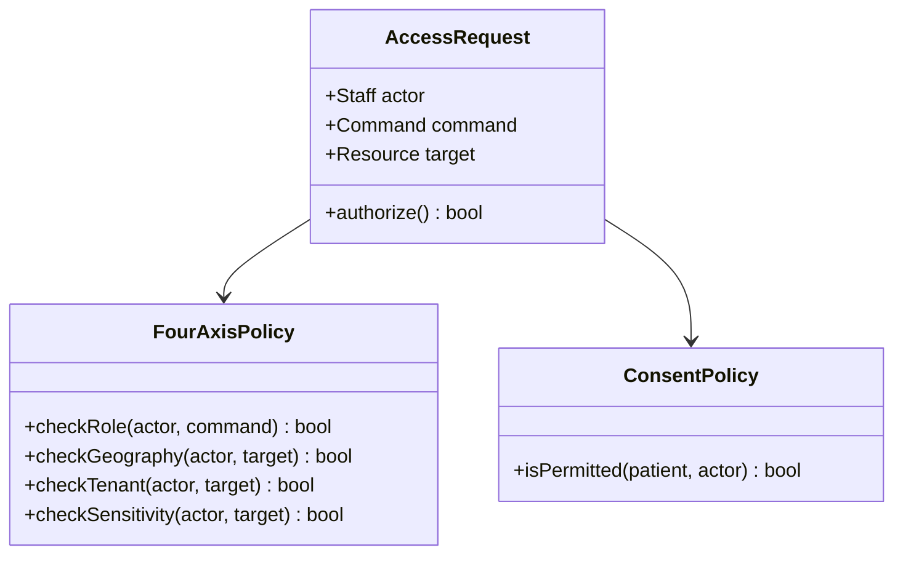

# 56 — Domain Class Diagram

The object-oriented design view of the core domain. Behaviour (methods) reflects the
commands of doc 03; structure aligns with the conceptual model (doc 55) and physical schema
(doc 48).

## Core domain

## Access-control classes

## Design notes
- **Capability-based:** `Staff.holds(command)` drives both authorisation and UI rendering —
  there is no per-role screen class.
- **Authorisation** is a pipeline: `FourAxisPolicy` (role · geo · tenant · sensitivity) then
  `ConsentPolicy`. A failure short-circuits to 403 and an `AuditEntry`.
- **Immutability:** `AuditEntry.append()` is the only write path; no update/delete methods.
