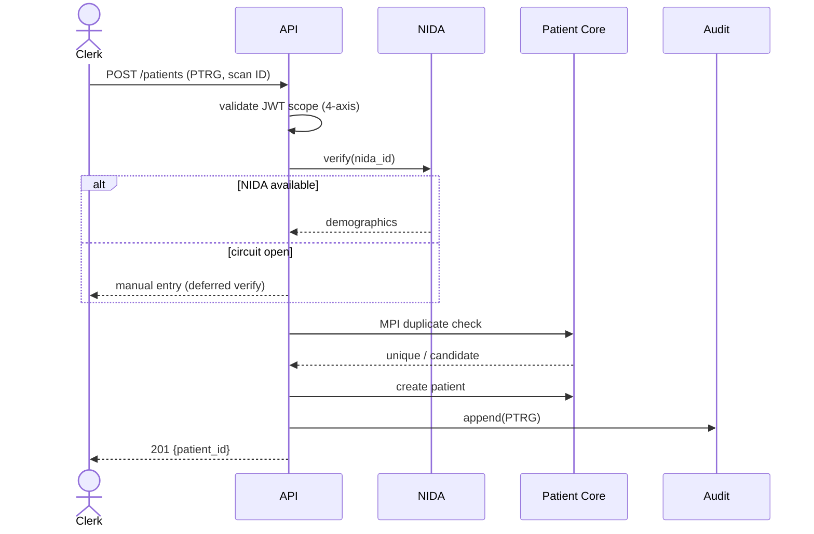
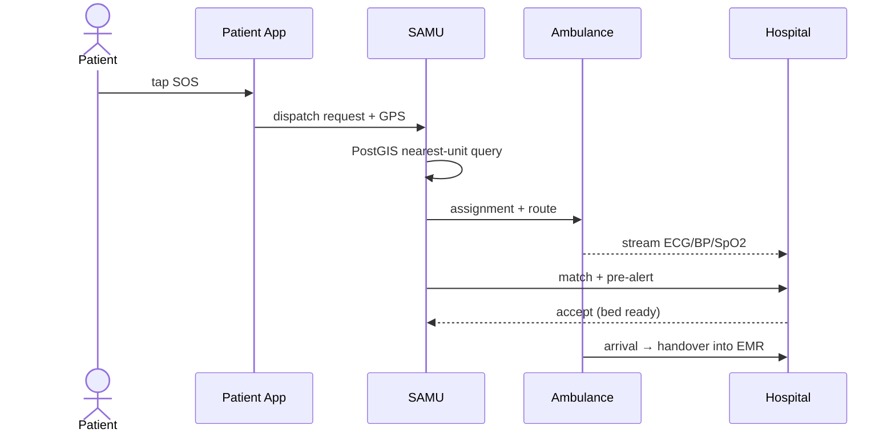
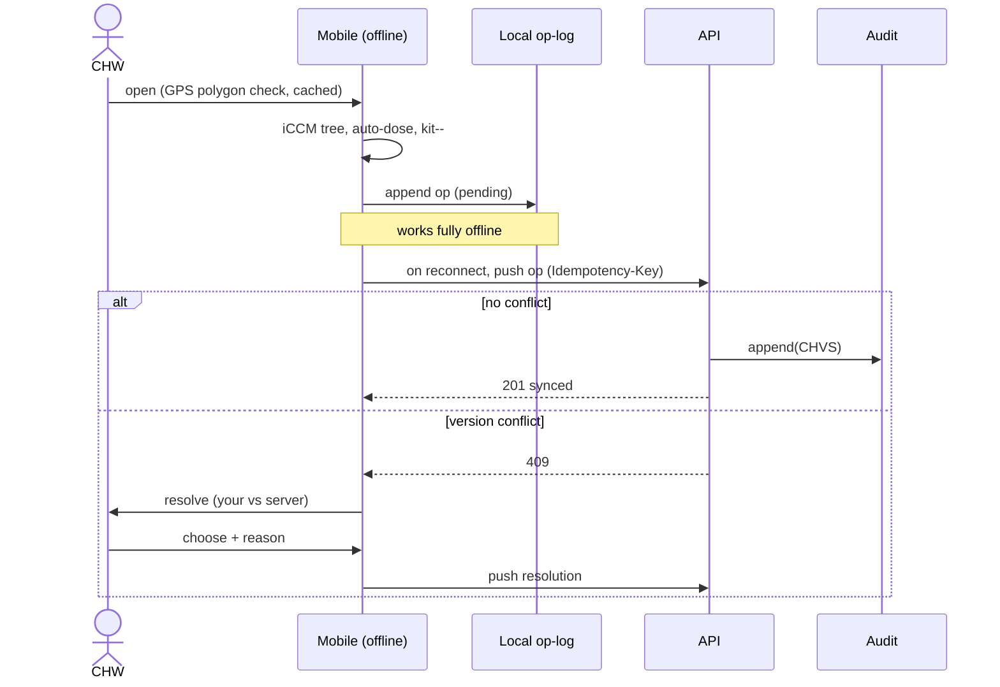
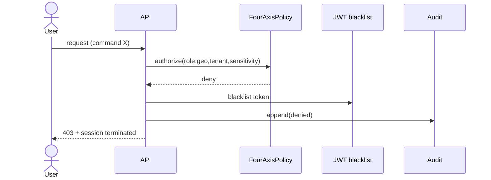

# 57 — Sequence Diagrams

Dynamic behaviour for the platform's most important interactions. Each aligns with a use
case in [53](53-use-case-model.md) and the API of [49](49-api-contract.md).

## Patient registration (NIDA)



## Prescribe → dispense → claim

```mermaid
sequenceDiagram
    actor Clinician
    actor Pharmacist
    participant API
    participant Stock
    participant RSSB
    participant EBM
    participant Audit
    Clinician->>API: POST /prescriptions (RXNW, signed)
    API->>API: validate ICD vs diagnosis
    API->>Audit: append(RXNW)
    API-->>Clinician: 201 {code}
    API-->>+Pharmacist: SMS code to patient
    Pharmacist->>API: POST /prescriptions/{code}/dispense (RXDP)
    API->>Stock: FEFO select & verify expiry
    Stock-->>API: batch ok
    API->>RSSB: eligibility + split
    RSSB-->>API: covered / co-pay
    API->>Stock: decrement
    API->>EBM: submit invoice
    EBM-->>API: certification token
    API->>Audit: append(RXDP)
    API-->>-Pharmacist: 201 {receipt}
```

## Emergency SOS dispatch



## Offline CHW visit & sync



## Access denied (out of scope)


