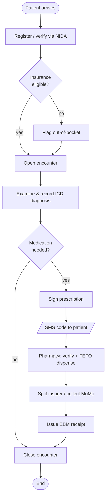
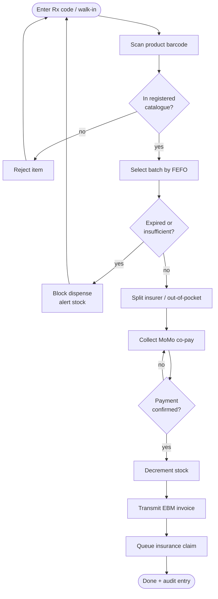
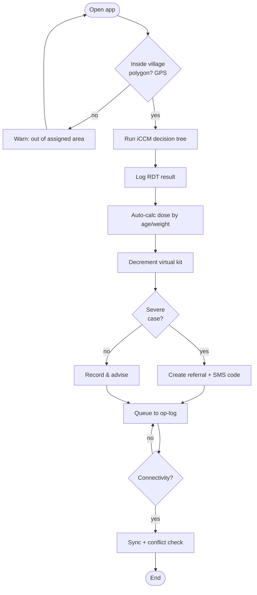
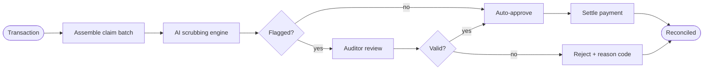

# 58 — Activity Diagrams

Workflow (process) view of key end-to-end activities, including decision points and parallel
paths. Complements the sequence diagrams in [57](57-sequence-diagrams.md).

## Outpatient visit (registration → dispensing)

## Dispensing with FEFO & validation

## CHW offline iCCM visit

## Insurance claim lifecycle

