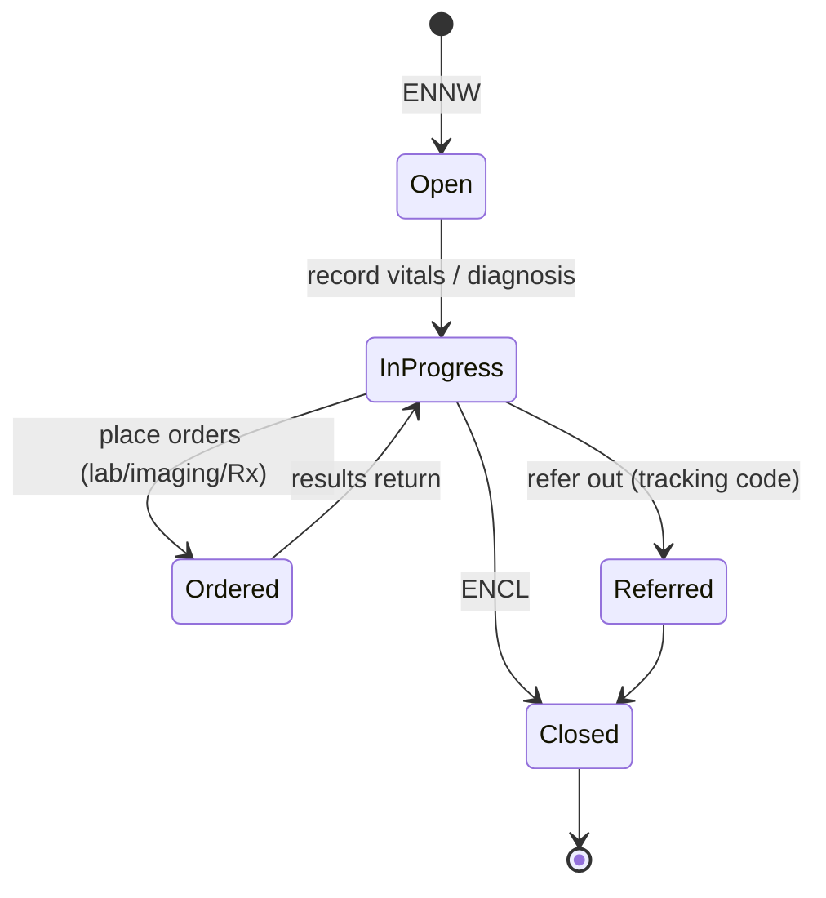
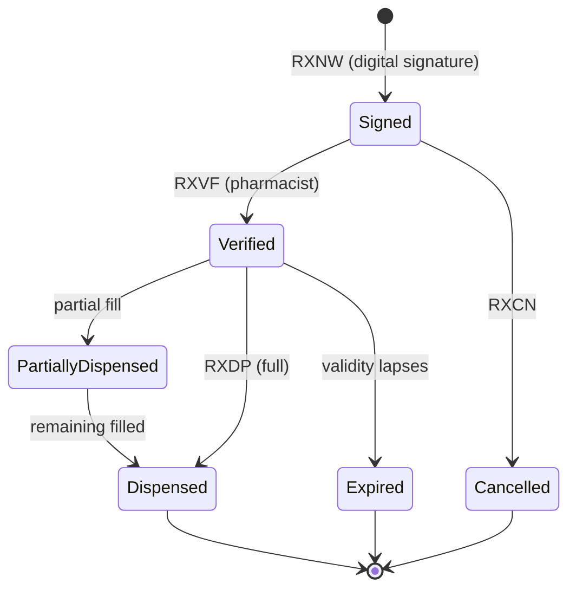
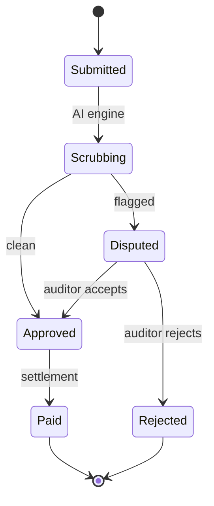
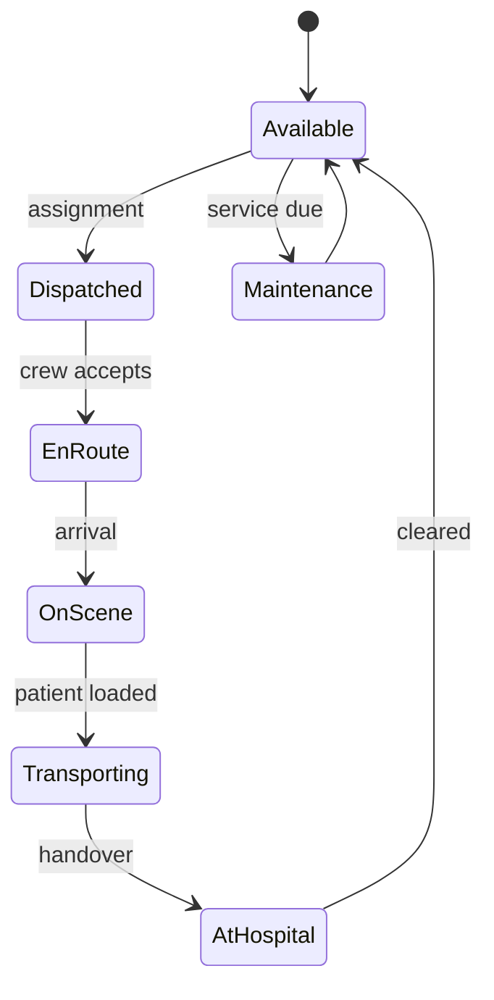
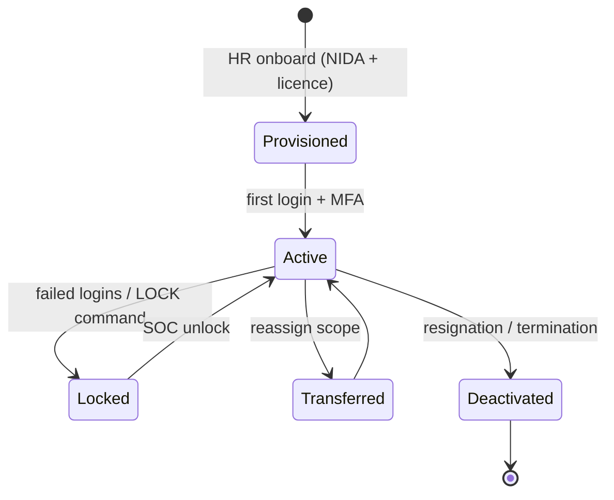
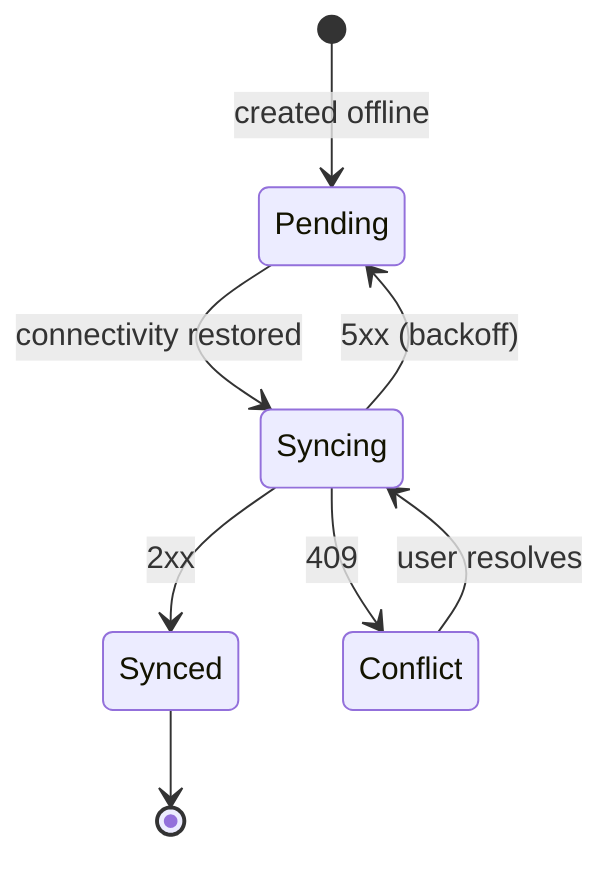

# 59 — State Transition Diagrams

Lifecycle (state machine) view of the platform's key stateful entities. States and
transitions align with the domain model in [56](56-domain-class-diagram.md).

## Encounter

## Prescription

## Insurance claim

## Ambulance / dispatch

## User account (access lifecycle)

## Offline sync (mobile record)

