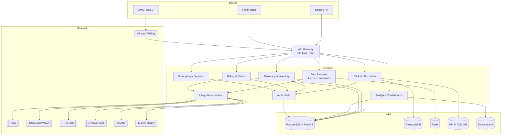
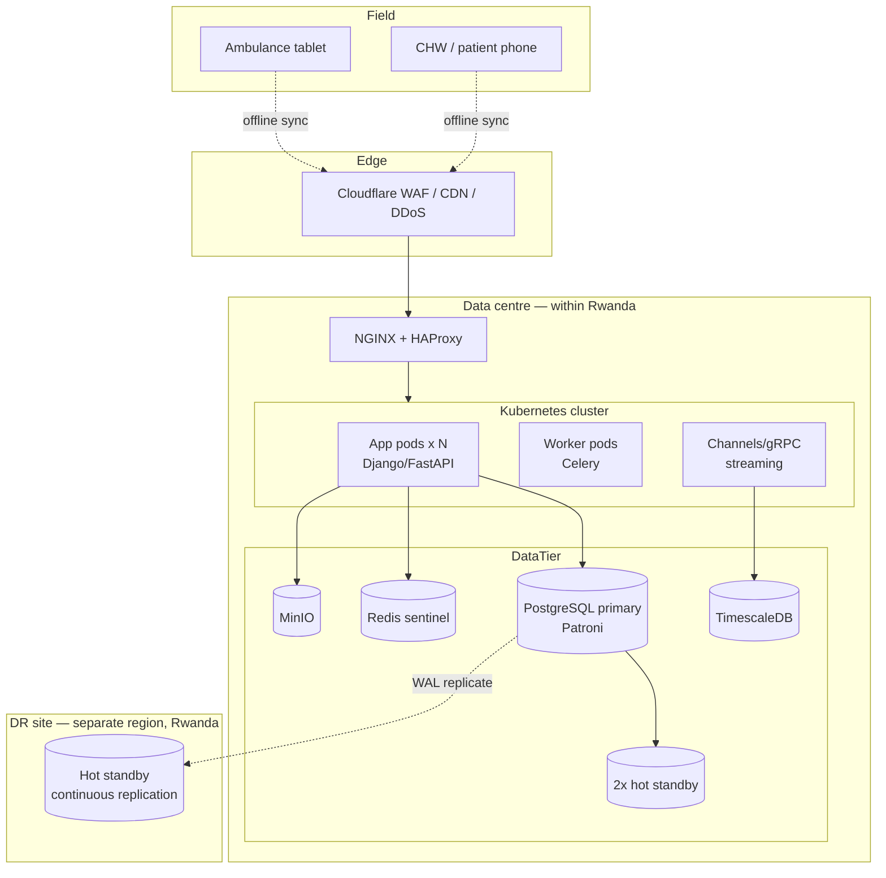

# 60 — Component & Deployment Diagrams

The static implementation view (components and their interfaces) and the physical view
(how components map to infrastructure). Aligns with the technology stack in
[07](07-technology-stack.md) and deployment doc [23](23-deployment-and-infrastructure.md).

## Component diagram

## Deployment diagram

## Notes
- **Stateless app tier** scales horizontally; **Patroni** manages PostgreSQL HA (failover
  < 10 s); **Redis sentinel** for cache/session HA.
- **Data residency:** all PHI and backups stay within Rwanda; DR is a separate in-country region.
- **Service mesh (Istio)** provides mTLS between services (not drawn, see doc 07/08).
- Field devices reconcile through the edge using the offline op-log (doc 51).
