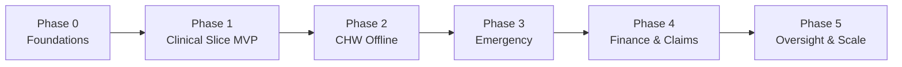

# 64 — MVP Scope & Delivery Roadmap

What to build first, in what order, and how we know it works. Grounded in the requirements
([52](52-software-requirements-specification.md)), the access model ([04](04-access-control-model.md)),
and the contracts ([48](48-database-schema.md)/[49](49-api-contract.md)/[50](50-frontend-architecture.md)/[51](51-mobile-offline-architecture.md)).

## Guiding principle

Do **not** build all 21 functional requirements at once. Build the **spine** (identity,
command-driven access, audit chain, shared core) once, prove it through **one vertical slice**
end-to-end, then add slices. Every slice ships against **stubbed national integrations** so
external partnership/legal timelines never block engineering.

## MVP definition

**The MVP is the Clinical Slice:** a patient can be registered, seen, diagnosed, prescribed
for, and dispensed to — in one facility tenant — with full four-axis access control and a
verifiable audit chain.

### In scope (MVP)
| Capability | FR | Commands |
|---|---|---|
| Identity + command-driven login (JWT, four-axis, MFA) | FR-15, FR-16 | auth |
| Register / search / view patient (NIDA **stub**) | FR-01, FR-02 | `PTRG PTSR PTVW PTTM` |
| Encounter: open, vitals, ICD diagnosis, close | FR-03 | `ENNW ENVT ENDX ENCL` |
| Prescribe (digitally signed) | FR-05 | `RXNW` |
| Verify + dispense under FEFO (barcode) | FR-06 | `RXVF RXDP STIN` |
| POS split + EBM receipt (EBM **stub**) | FR-07 | `PHPS PHSP PHEB` |
| Immutable audit chain on every action | FR-19 | (all) |
| Unified dashboard rendered from commands | FR-17 (basic) | `ANVW` |

### Explicitly out of scope (MVP)
- Offline mobile / CHW iCCM (Slice 2), emergency dispatch (Slice 3).
- Insurance claim settlement, CBHI, payroll, B2B marketplace.
- FHIR push to DHIS2/eIDSR, surveillance dashboards.
- Real NIDA / RSSB / RRA EBM / MoMo integrations (stubbed until agreements land).

### MVP success criteria
- A clinician completes register → diagnose → prescribe → dispense in one session.
- An out-of-scope request returns **403**, ends the session, and is logged.
- The audit chain verifies (no broken hashes) after a full day of test traffic.
- Meets the relevant targets in [25](25-load-balancing-and-performance.md) on a staging dataset.

## Roadmap

### Phase 0 — Foundations (weeks 1–3)
- Repo scaffolding (backend/frontend/mobile/CI — already laid down), `docker-compose` up.
- Apply [48](48-database-schema.md) migration; RLS + audit chain working.
- Auth: JWT (RS256), MFA, four-axis policy middleware, command-bundle seeding from doc 03.
- CI green: lint + unit tests + container build.
- **Exit:** a seeded user can log in and the dashboard renders only their commands.

### Phase 1 — Clinical Slice MVP (weeks 4–9)
- Build the in-scope capabilities above against NIDA/EBM stubs.
- Frontend command bar + the clinical/pharmacy surfaces; design tokens from [05](05-design-system.md).
- E2E test of the full slice; audit-chain verification job.
- **Exit:** MVP success criteria met on staging.

### Phase 2 — CHW Offline (weeks 10–15)
- Flutter app, op-log + sync engine + conflict resolution ([51](51-mobile-offline-architecture.md)).
- iCCM trees, GPS polygon check, referrals with SMS codes (SMS stub → Africa's Talking).
- **Exit:** a CHW completes an offline visit that reconciles on reconnect.

### Phase 3 — Emergency (weeks 16–20)
- SOS intake, PostGIS nearest-unit dispatch, vitals telemetry (WebSocket), ED handover.
- **Exit:** an SOS produces a dispatch and a pre-hospital record that flows into an encounter.

### Phase 4 — Finance & Claims (weeks 21–26)
- Claims pipeline + AI scrubbing stub, CBHI, MoMo integration (sandbox), real EBM (if certified).
- **Exit:** a dispense generates a claim that moves through scrubbing to settlement (sandbox).

### Phase 5 — Oversight & Scale (weeks 27+)
- FHIR push to DHIS2/eIDSR, surveillance + national dashboards, read replicas, HA/DR drills.
- **Exit:** hourly FHIR bundles validated; failover drill passes.

## Team & sequencing (suggested)
- **Platform/backend** owns Phase 0 + the API/auth/audit spine.
- **Frontend** starts in Phase 1 once the API contract is stable.
- **Mobile** starts in Phase 2 (reuses the same API + op-log contract).
- **Integrations** engineer maintains stubs from day 1, swaps in real adapters per phase.

## Dependencies & risks (gate production, not code)
| Item | Needed for | Mitigation while building |
|---|---|---|
| NIDA / RSSB / RRA EBM / UNHCR agreements | Production go-live | Build against stubs + circuit breakers ([09](09-interoperability.md)) |
| DPIA under Law N° 058/2021 | Processing real PHI | Start the DPIA in Phase 0; use synthetic data until approved |
| In-Rwanda hosting + HSM/Vault | Production | Use local/dev infra for non-PHI dev ([32](32-secrets-and-key-management.md)) |
| Command catalogue freeze | Auth/UI/audit | Freeze [03](03-command-catalogue.md) before Phase 1 |

## What's ready to start now
Phase 0 can begin immediately: the scaffolding, schema, API/auth/audit contracts, and design
tokens all exist. Begin with the migration + auth spine, then the Clinical Slice.
